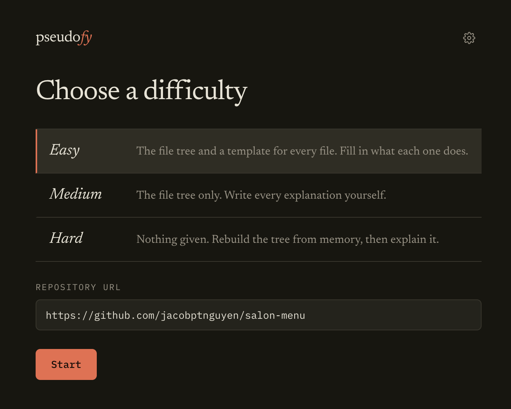
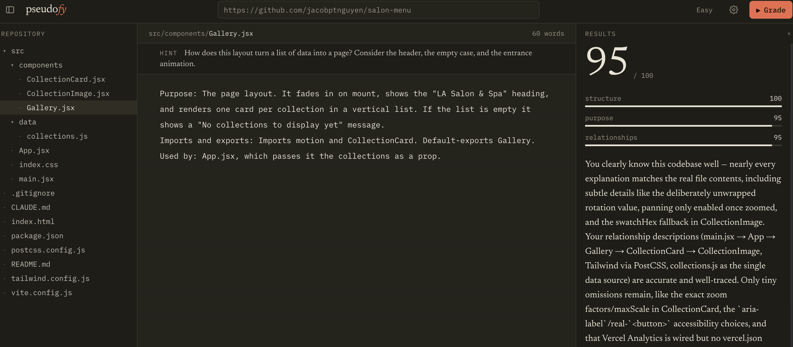

# Pseudofy

Test how well you really know a codebase. Pick a difficulty, explain each file of a GitHub repo in plain English, and get graded against the real code.

## [▶ Live Demo](https://pseudofy-gn4q.vercel.app/)





## The problem

Reading code and knowing code are different things. It's easy to feel familiar with a repo after skimming it, and hard to tell whether you could actually explain where things live, what each file does and how the pieces connect. The usual ways of checking, such as quizzes and flashcards, test isolated facts instead of your mental model of the whole system.

Pseudofy makes you build that model yourself. You write each file's purpose in a blank, minimal IDE, and on the harder levels you rebuild the repo's structure from memory too. An AI grader then compares your version with the real repo, file by file, and shows where your understanding is solid, where it's off, and which important files you forgot existed.

## Difficulty levels

| Level | What you get | What you do |
| --- | --- | --- |
| Easy | The real file tree, a fill-in template for every file, and a short AI-written hint per file | Complete each template |
| Medium | The real file tree only | Write every explanation yourself |
| Hard | Nothing | Rebuild the tree from memory, then explain it |

You enter the repo URL on the start screen for every level. Easy and Medium use it right away to load the tree. Switching difficulty later takes you back to the start screen. Easy and Medium support repos with up to 300 source files; larger repos are Hard only.

## Features

- **Three difficulty levels:** from a guided template with hints to a blank slate.
- **Hints that don't give the answer:** on Easy, each file gets a one-line nudge written from its code, phrased as a question about its role, dependencies and users.
- **Minimal IDE:** a toggleable file tree and a plain-text editor for each file's explanation. On Hard you can create, rename and delete files and folders; on Easy and Medium the tree is given and locked.
- **Any public GitHub repo:** paste a URL. Nothing is fetched until you start (Easy and Medium) or grade (Hard).
- **Rubric-based grading:**
  - an overall score out of 100
  - sub-scores for structure (30%), purpose (40%) and relationships (30%)
  - per-file feedback marking each file as matched, misplaced (with the real path) or nonexistent
  - a list of important files you missed
  - on Easy and Medium the tree is given, so structure is full marks and the score is weighted toward purpose and relationships
- **Detail is rewarded only when it's correct:** confident wrong claims cost more than vague ones.
- **Autosaved:** your tree, notes, hints and difficulty are kept in local storage, so a refresh doesn't lose your work.
- **Bring your own key:** each user adds their own Claude API key in Settings. It's kept in their browser, so the host pays nothing and there's no shared rate limit. Easy needs the key at start, because the hints are written with it.

## Tech stack

- Next.js 16 (App Router) with TypeScript
- Tailwind CSS v4
- Claude Opus 5 for grading and Claude Sonnet 5.5 for hints (`@anthropic-ai/sdk`), with structured outputs validated with Zod
- GitHub REST API for the repo tree and file contents
- Deployed on Vercel

## Running locally

```bash
npm install
npm run dev                         # then add your Claude API key under Settings (gear icon)
npm test                            # GitHub URL parsing and file-selection tests
```
